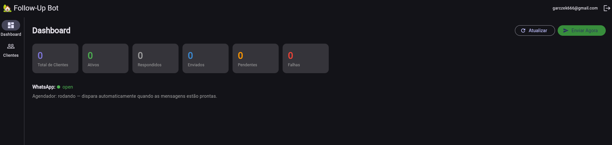

# 🏡 Real Estate Follow-Up Bot

> **Status:** 🧪 **Currently in Testing Phase**  
> *This application is currently in active field-testing by a professional Real Estate Agent.*

A full-stack, automated follow-up bot and CRM system designed specifically for real estate agents. The application automates engaging with clients over WhatsApp by scheduling personalized messages, allowing agents to focus on closing deals rather than manual follow-ups.

## 📸 Dashboard Preview

As seen in the dashboard, the system monitors real-time statistics of client interactions, including active clients, responded messages, pending follow-ups, and failed message attempts. It also indicates the live connection status of the WhatsApp integration and the automated scheduler.

---

## 🚀 Tech Stack

### Frontend (Cross-Platform Flutter)
- **Framework:** Flutter / Dart
- **State Management:** Provider
- **Storage:** Shared Preferences
- **Localization:** `intl` package (Fully localized to Brazilian Portuguese - `pt-BR`)
- **Capabilities:** Cross-platform support (Web, Android, iOS, Windows, macOS, Linux) with a responsive dashboard optimized for web/desktop.

### Backend (Node.js & Express)
- **Runtime:** Node.js
- **Framework:** Express.js 
- **Language:** TypeScript
- **Authentication:** JWT (JSON Web Tokens) & bcryptjs
- **Database / BaaS:** Supabase (PostgreSQL)
- **Task Scheduling:** `node-cron` for running background workers to dispatch text messages automatically.
- **Email/Notifications:** `nodemailer`

---

## 🛠️ Key Features

- **Automated Message Scheduler:** A robust CRON-based background worker that checks database queues and dispatches queued follow-up messages intelligently without manual intervention.
- **WhatsApp Integration:** Hooks into WhatsApp to allow programmatic delivery of templated follow-up campaigns.
- **Client Pipeline Management:** Add and manage prospective leads, dictate the amount of days in the follow-up cycle, and configure preferred sending times securely.
- **Real-Time Analytics Dashboard:** Offers high-level metrics of the pipeline (Total Clients, Active, Replied, Sent, Pending, and Failed).
- **Customizable Templates:** Standardize communication while allowing agents to apply dynamic variables for personalization.
- **Secure Authentication:** REST API securely protected with JWT middleware.

---

## 📁 Project Architecture

The repository is structured as a monorepo consisting of:
- `/frontend` - The Flutter client app containing screens, state models, and the API interfacing layer.
- `/backend` - The Express.js backend containing route definitions (auth, clients, dashboard, messages, templates), worker scripts, and database controllers.

## ⚙️ Getting Started (Local Development)

### Prerequisites
- [Node.js](https://nodejs.org/) (v16+)
- [Flutter SDK](https://docs.flutter.dev/get-started/install) (v3+)
- A [Supabase](https://supabase.com/) project

### Backend Setup
1. Navigate to the `backend` directory.
2. Run `npm install` to install dependencies.
3. Create a `.env` file based on `.env.example` and add your Supabase credentials and JWT secrets.
4. Run `npm run dev` to start the development server via `ts-node-dev`.

### Frontend Setup
1. Navigate to the `frontend` directory.
2. Run `flutter pub get` to fetch Dart dependencies.
3. Run `flutter run -d chrome` (or your preferred target device) to start the frontend application.

---
